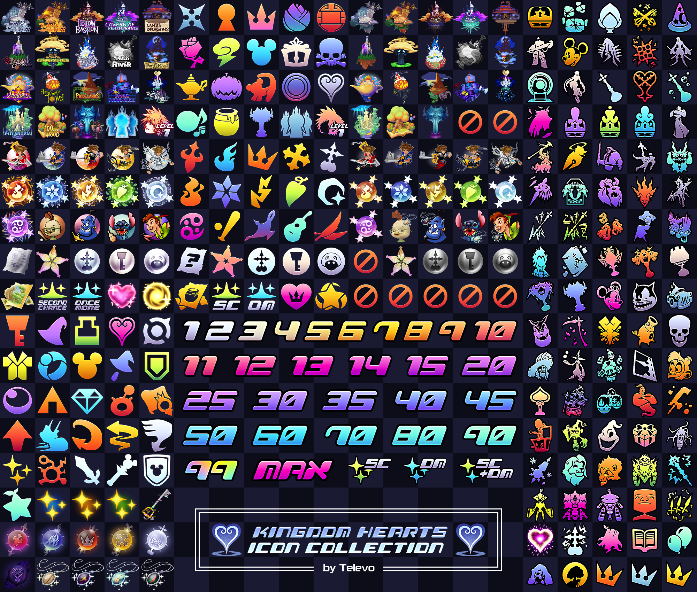

# Kingdom Hearts Re:Collection

**Kingdom Hearts Re:Collection is a free archive of art assets and custom fonts created by Televo.** 

There are two main art styles included in Re:Collection; Default (flashy in-game inspired artwork) and Minimal (representational symbols). If you decide to use these assets publicly, giving credit is much appreciated though not necessary. Please feel free to message me anytime on Discord at Televo#9400 as I love to see how my efforts here have helped.

Special thanks to auscompgeek for creating the Legacy Summon icons, Kimpchuu for creating the Proof of Fantasy and those who support and share my work with the community :)

**If you appreciate what I do with all your heart, consider [supporting me on KoFi](https://ko-fi.com/televo).**

[Download the Re:Collection Here](https://github.com/Televo/kingdom-hearts-recollection/releases/download/v3.0/Kingdom-Hearts-ReCollection.zip) or go to the releases page and click on the latest .zip file.

Regarding fonts, in comparison to similar fonts floating around (DFPW5_EUR, KH_ALL_MENU_I and Kingdom_Hearts_Font) the font characters in Re:Collection have been recreated directly from the games. They also have vastly improved spacing/kerning (though you must use metrics, not optical spacing) and the file size has been optimised to work efficiently on websites.

KHTitle originates from the room labels in The World That Never Was while KHScala is sourced from Scala ad Caelum. As the Scalan language has not been fully deciphered, the font can only be as correct as the most recent translation.

Each font contains all unicode characters of Basic Latin and a few specific characters of Latin-1, shown in this character list: ABCDEFGHIJKLMNOPQRSTUVWXYZabcdefghijklmnopqrstuvwxyz0123456789.,:;…!?*#/\(){}[]-_“”‘’"'@&©°|¢$€£¥+-×÷=≠><≥≤~^%
