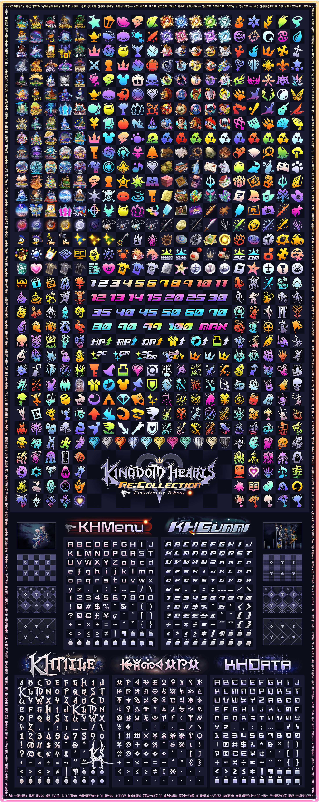

# Kingdom Hearts Re:Collection

**Kingdom Hearts Re:Collection is a free archive of art assets and custom fonts created by Televo.** 

There are over 600 icons in Re:Collection inspired from all across the series including worlds, magic, forms, summons, key items, menu icons, numbers, progression icons, wallpapers and more. They can be classified into two main artistic styles; Detailed (flashy game artwork) and Minimal (coloured symbols).

If you decide to use these assets and fonts publicly, giving credit is much appreciated :) though not absolutely necessary. Please feel free to message me anytime on Discord at Televo#9400 as I love to see how my efforts have helped you create something awesome. I have no doubt the time spent on this project is well over 1000 hours.

*Special thanks to auscompgeek and Kimpchuu for creating and allowing me include the Legacy Summons icons and Proof of Fantasy respectively, as well as those who support and share my work with the community :D*

**If you appreciate what I do with all your heart, consider [supporting me on KoFi](https://ko-fi.com/televo).** Of those few who have already done so, I am tremendously thankful, regardless of the amount.

[Download Re:Collection Here](https://github.com/Televo/kingdom-hearts-recollection/releases/download/v4.0/Kingdom-Hearts-ReCollection.zip) or go to the releases page and click on the latest .zip file to download it.

In comparison to similar fonts found online, the characters in Re:Collection have been accurately recreated directly from the games where possible and have vastly improved spacing/kerning (especially when setting spacing to metric).

Numerous languages are supported including English, French, German, Italian, Spanish, Turkish, Polish, Norwegian, Swedish, Russian, Portuguese, Danish, Indonesian and many more latin-based languages. Note that while KHScala contains all known symbols, the font will contain translation inaccuracies because the Scalan language has not been fully deciphered.

Included: KHMenu (Start Menu Font), KHGummi (Gummiship Font), KHTitle (Title Logo Font), KHScala (Scala ad Caelum Font)

Not Included: DFPW5_EUR (Start Menu Font), KH2_ALL_MENU_I (Gummiship Font), Kingdom Hearts Font (Title Logo Font), Comic Hearts (Cutscene Subtitle Font), DFSouGei-W5G (Command Menu Font), Floridian Script (Birth by Sleep Font), Serpentine (Final Mix Font), Impressum (Offical Website Font)
